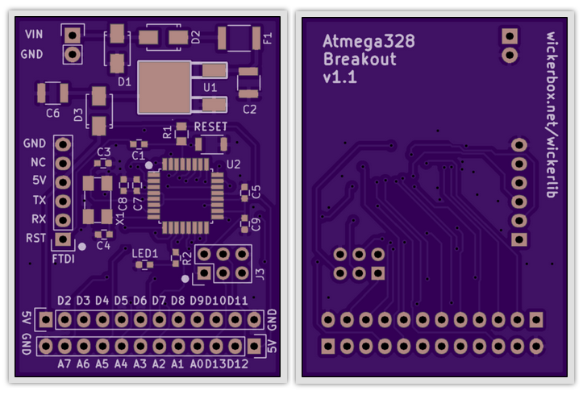

# Basic Breakout Board for Atmega328 Microcontroller

This breakout board was created using the <a href="https://github.com/wickerbox/wickerlib/blob/master/templates/atmega328-template.zip?raw=true">Wickerlib Atmega328 Template</a>. 

That template just contains the schematic. This project was built to verify the design, so it contains the PCB layout, gerbers, bill of materials, and photos of the final build.

|Ref|Qty|Description|MF_Name|MF_PN|Digikey|
|---|---|-----------|-------|-----|-------|
|C1,C5,C7-C9|1|CAP CER 0.1UF 100V X7R 0603|Murata|GRM188R72A104KA35D|490-3285-1-ND|
|C2,C6|1|CAP CER 10UF 25V X7R 1210|Taiyo Yuden|TMK325B7106KN-TR|587-2599-1-ND|
|C3,C4|1|CAP CER 22pF 100V C0G NP0 0603|Kemet|C0805C220J5GACTU|399-11145-1-ND|
|D1|1|TVS DIODE 14VWM 23.2VC SMAJ14A-13-F SMA|TI|SMAJ14A-13-F|SMAJ14A-FDICT-ND|
|D2,D3|1|DIODE SCHOTTKY 20V 1A SMA|Vishay|SS12-E3/61T|SS12-E3/61TGICT-ND|
|F1|1|RESETTABLE FUSE 1.1A 25V MF-MSMF|Bourns|MF-MSMF110/24X-2|MF-MSMF110/24X-2CT-ND|
|J1|1|CONN TERM SCREW GREEN 2.54MM 2POS TH|OnShoreTech|OSTVN02A150|ED10561-ND|
|J2|1|HEADER MALE 6POS TH 1x06 0.1”|Harwin|M20-9992046|952-1902-ND|
|J3|1|HEADER MALE 6POS 2x3 0.1”|Harwin|M20-9720345|952-1921-ND|
|J4,J5|1|HEADER FEMALE 10POS TH 1x10 0.1”|Harwin|M20-7821042|952-1846-ND|
|LED1|1|LED AMBER DIFFUSED 0603 SMD|OSRAM Opto|LA L296-Q2R2-1-Z|475-2712-1-ND|
|R1,R2|1|RES SMD 10K OHM 5% 1/8W 0805|Yageo|RC0805JR-0710KL|311-10KARCT-ND|
|S1|1|SWITCH TACTILE SPST-NO 0.05A 12V|Omron|B3U-1000P|SW1020CT-ND|
|U1|1|IC REG LDO 5V 1.1A NCP1117 DPAK|ON Semi|NCP1117DT50G|NCP1117DT50GOS-ND|
|U2|1|IC MCU 8BIT 32KB FLASH 32TQFP|Atmel|ATMEGA328P-AU|ATMEGA328P-AU-ND|
|X1|1|16MHz ±30ppm Crystal 18pF 40 Ohm 4SMD NOLEAD|CTS|406I35D16M00000|CTX1206CT-ND|

