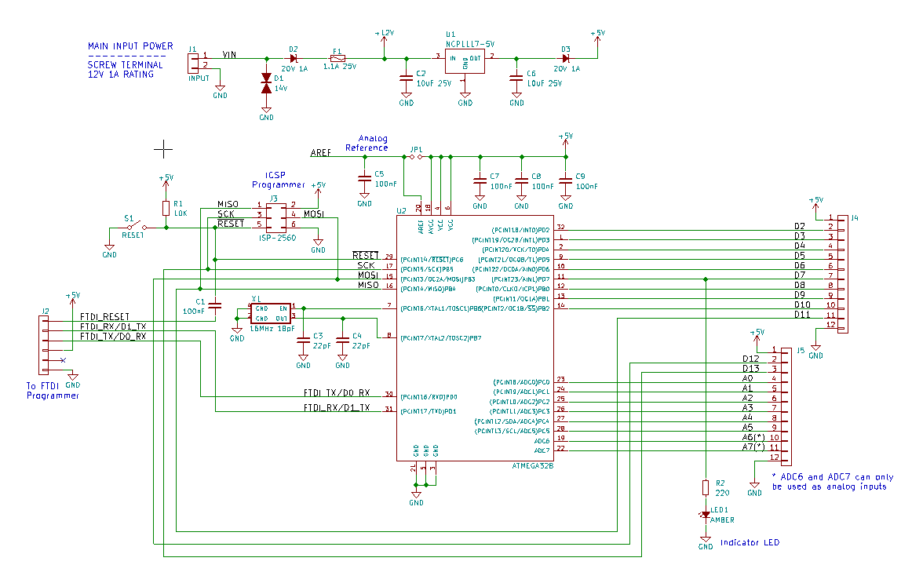
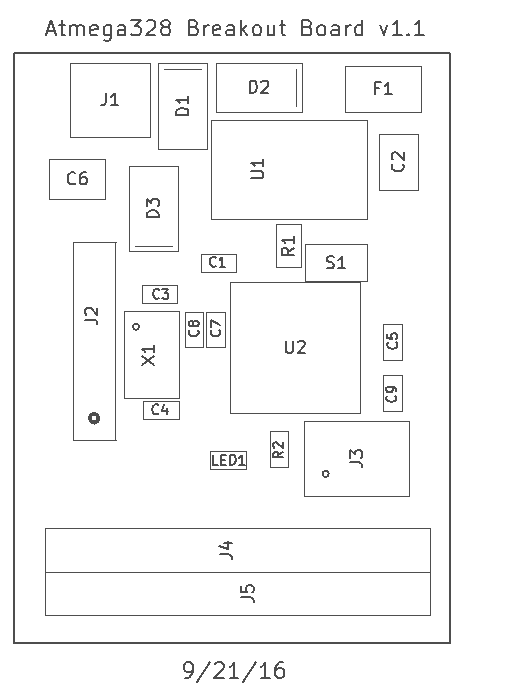
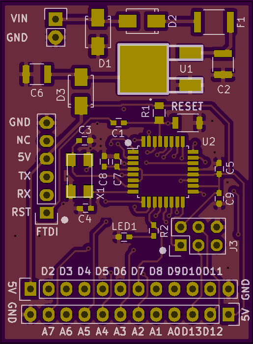

<!--- start title --->
# Basic Atmega328 Breakout Board v1.1

This is a breakout board for the Atmega328. It supports input voltage up to 16V, regulating down to 5V for the microcontroller. A bootloader can be loaded over ICSP and then the board can be powered and communicated with over an FTDI cable. All the input/output pins are broken out for prototyping.

Updated: 31 Dec 2016

Author: Jenner Hanni
Website: http://wickerbox.net
Company: Wickerbox Electronics
License: CERN Open Hardware License v1.2
<!--- end title --->

The project is released as open hardware under the CERN v1.2 Open Hardware license.

The project uses the Atmega328 template from [wickerlib](http://wickerbox.net/wickerlib).

You can order a set of three bare boards for $13.35 from OSH Park [here](https://oshpark.com/shared_projects/Bx0lZ6cN).

### Bill of Materials

<!--- bom start --->

<!--- bom end --->

