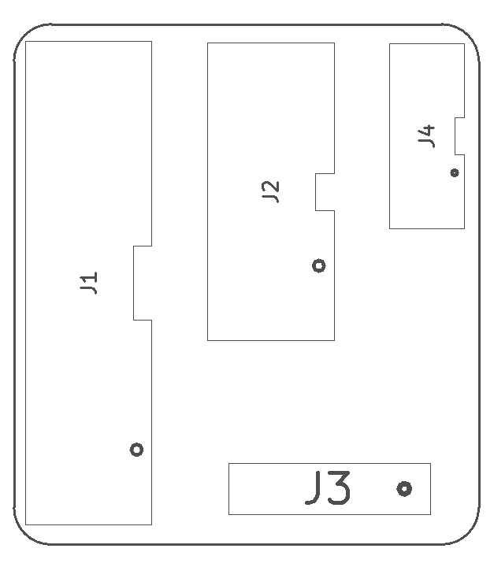
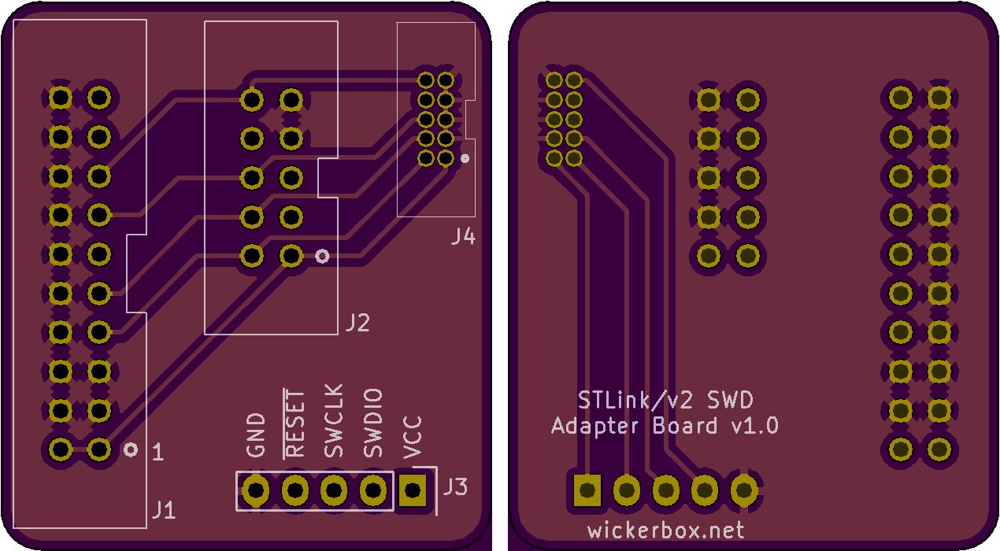

<!--- start title --->
# ATSAMD21G18-STLinkv2 JTAG Adapter Board v1.0
Converts 20-pin giant JTAG connector into 1.27mm-pitch 2x5 connector.

- Updated: 14 Aug 2017

- Author: Jenner Hanni
- Website: http://wickerbox.net
- Company: Wickerbox Electronics
- License: CERN Open Hardware License v1.2
<!--- end title --->

Description.

<!--- bom start --->
### Bill of Materials

|Ref|Qty|Description|Digikey PN|
|---|---|-----------|------|
|J1|1|HEADER MALE 20POS TH 2x10 0.1IN KEY|ED10524-ND|
|J2|1|HEADER MALE SHROUDED 10POS 2x5 0.1IN KEY JTAG|30310-6002HB-ND|
|J3|1|HEADER MALE 5POS TH 1x05 0.1IN|952-1902-ND|
|J4|1|HEADER MALE SHROUDED 10POS 2x5 0.27MM KEY|1175-1627-ND|

<!--- bom end --->

