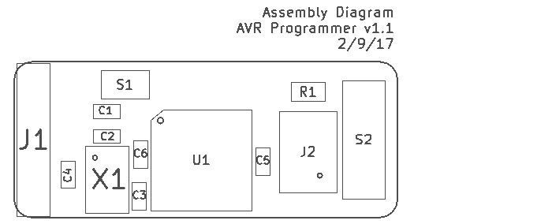
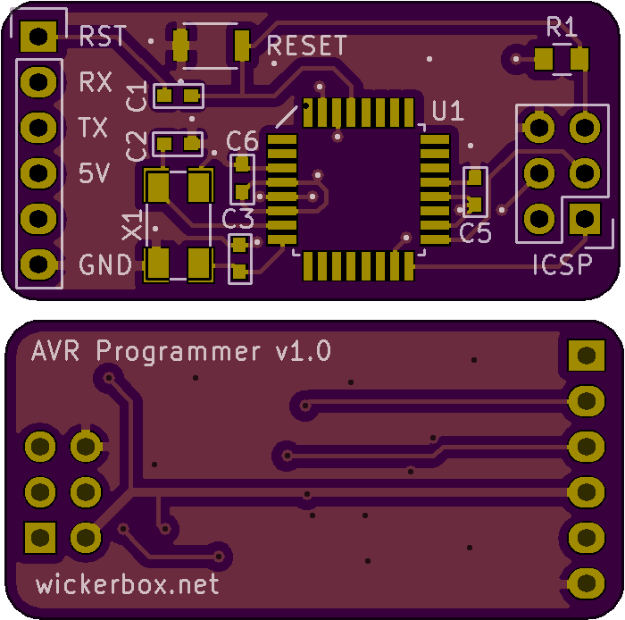

<!--- start title --->
# Atmega328-based AVR Programmer v1.1
Simple Atmega328-based AVR programmer with ISP and FTDI breakout

Updated: 07 March 2017

Author: Jenner Hanni
Website: http://wickerbox.net
Company: Wickerbox Electronics
License: CERN Open Hardware License v1.2

<!--- end title --->
I made it to have a dedicated board containing Nick Gammon's Arduino sketch for bootloading. 

### Bill of Materials

<!--- bom start --->
|Ref|Qty|Description|Digikey PN|
|---|---|-----------|------|
|C2 C3|2|CAP CER 22pF 100V C0G NP0 0603|399-11145-1-ND|
|C4|1|CAP CER 1UF 25V X7R 0603|587-2984-1-ND|
|C5 C6 C1|3|CAP CER 0.1UF 100V X7R 0603|490-3285-1-ND|
|J1|1|HEADER MALE 6POS TH 1x06 0.1”|952-1902-ND|
|J2|1|HEADER MALE 6POS 2x3 0.1”|952-1921-ND|
|R1|1|RES SMD 10K OHM 5% 1/8W 0805|311-10KARCT-ND|
|S1|1|SWITCH TACTILE SPST-NO 0.05A 12V|SW1020CT-ND|
|S2|1|SWITCH SLIDE SPDT 200MA 30V|EG1903-ND|
|U1|1|IC MCU 8BIT 32KB FLASH 32TQFP|ATMEGA328P-AU-ND|
|X1|1|CRYSTAL 16MHz 18pF 40 OHM 4SMD|CTX1206CT-ND|

<!--- bom end --->

