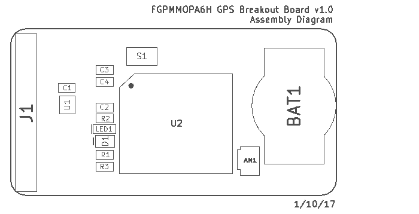
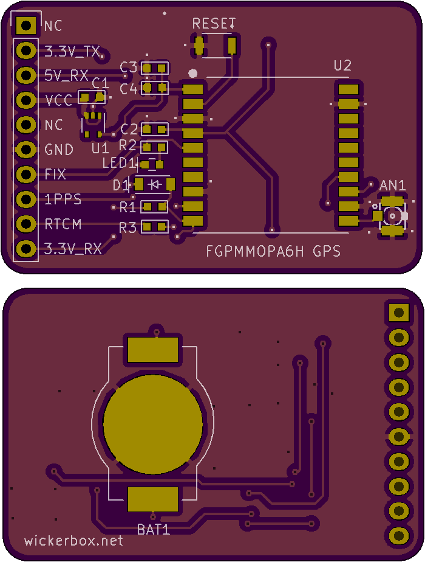

<!--- start title --->
# FGPMMOPA6H GPS Breakout Board v1.1
Simple breakout board for the FGPMMOPA6H GPS module

Updated: 23 Feb 2017

- Author: Jenner Hanni
- Website: http://wickerbox.net
- Company: Wickerbox Electronics
- License: CERN Open Hardware License v1.2

<!--- end title --->

- To use with a 5V FTDI cable, orient cable with RESET (green) at pin 1 on J1.

- To use with 5V controllers, connect VCC, 5V_RX, 5V_TX, and GND.

- To use with 3.3V controllers, connect VCC, 5V_RX, 3.3V_TX, and GND.

1PPS, RTCM, and the FIX are 3.3V-level signals and may not be interpreted correctly by a 5V system.

### Notes on 3.3V/5V compatibility

- Atmega328 provides output signals above 4.2V for HIGH and below 0.9V for LOW. 
- Atmega328 detects input signals above 3V as HIGH and below 1.5V for LOW.
- The FGPMMOPA6H provides output signals 2.0-3.3V for HIGH and 0-0.8V for LOW. 
- The FGPMMOPA6H detects input signals 2.4-3.3V for HIGH and 0-0.4V for LOW.

<!--- bom start --->
### Bill of Materials

|Ref|Qty|Description|Digikey PN|
|---|---|-----------|------|
|AN1|1|CONN UFL JACK STR 50 OHM SMD|H122041-ND|
|BAT1|1|CR1220 BATTERY HOLDER SMT FLATPIN|BK-916-CT-ND|
|C3 C2 C1|3|CAP CER 1UF 10V X7R 0603|1276-1946-1-ND|
|C4|1|CAP CER 0.01UF 50V X7R 0603|490-1512-1-ND|
|D1|1|DIODE GEN PURP 75V 250MA 1N4148 SOD123|1655-1360-1-ND|
|J1|1|HEADER MALE 10POS TH 1x10 0.1”|952-1902-ND|
|LED1|1|LED AMBER DIFFUSED 0603 SMD|475-2712-1-ND|
|R1|1|RES SMD 10K OHM 1% 1/8W 0603|RNCP0603FTD10K0CT-ND|
|R3 R2|2|RES SMD 470 OHM 5% 1/4W 0603|RHM470DCT-ND|
|S1|1|SWITCH TACTILE SPST-NO 0.05A 12V|SW1020CT-ND|
|U1|1|IC REG LDO 3.3V 0.15A SOT353|576-3193-1-ND|

|Ref|Qty|Description|Adafruit PN|
|---|---|-----------|------|
|U2|1|GPS MODULE PA6H MTK3339|790|

<!--- bom end --->

