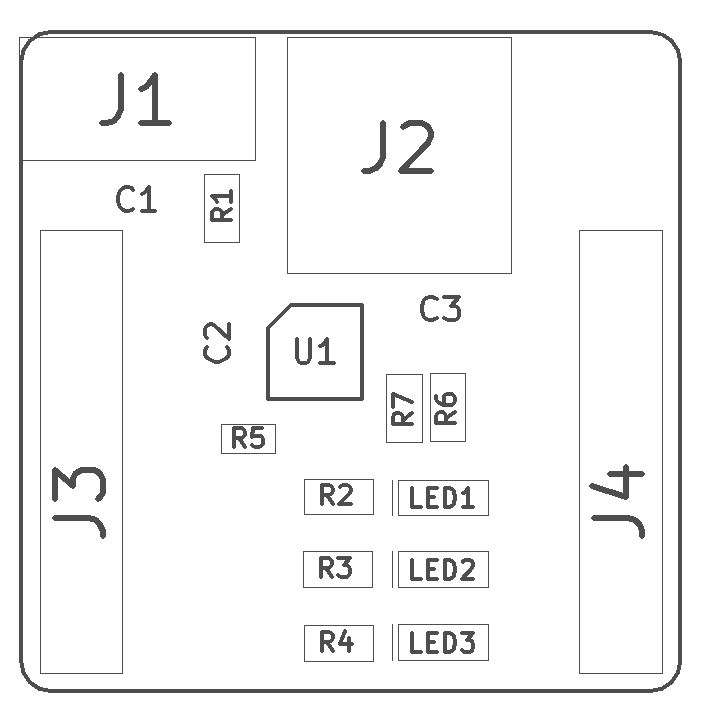
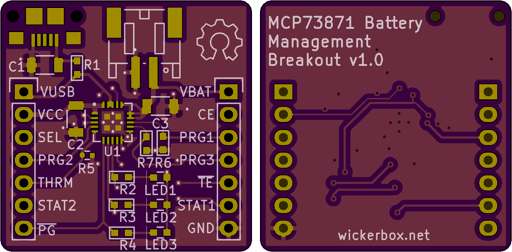

<!--- start title --->
# MCP73871 Battery Management Breakout Board v1.0
Breakout board for a load-sharing battery/power control chip.

- Updated: 20 Jul 2017

- Author: Jenner Hanni
- Website: http://wickerbox.net
- Company: Wickerbox Electronics
- License: CERN Open Hardware License v1.2
<!--- end title --->

Description.

<!--- bom start --->
### Bill of Materials

<!--- bom end --->
<!--- assy start --->
### Assembly Info for Quoting

<!--- assy end --->

