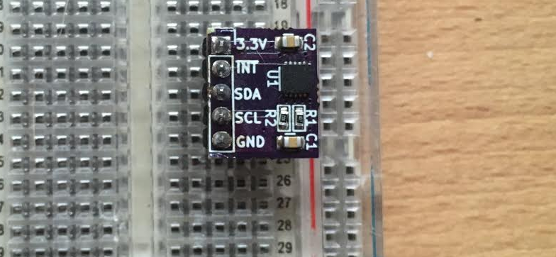
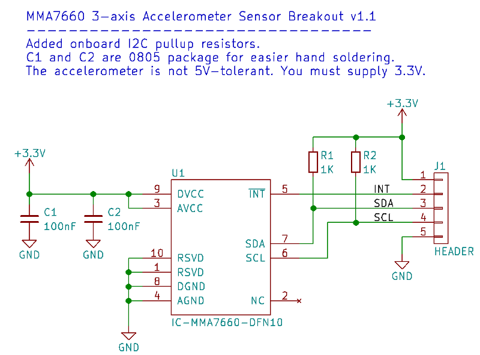
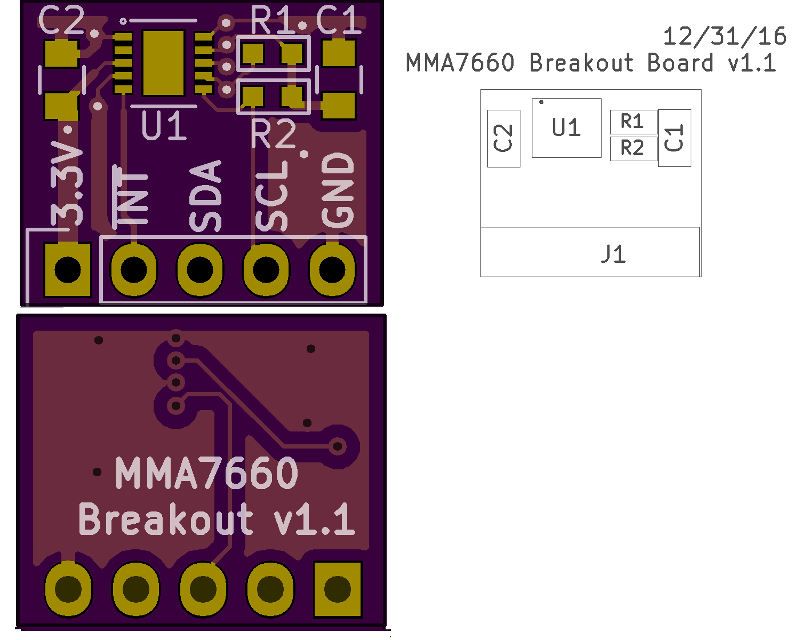

<!--- start title --->
# MMA7660 3-axis Accelerometer Breakout v1.1

A breadboard-compatible breakout board for the MMA7660 accelerometer.

Updated: 7 March 2017

- Author: Jenner Hanni
- Website: http://wickerbox.net
- Company: Wickerbox Electronics
- License: CERN Open Hardware License v1.2

<!--- end title --->
This is a breadboard-compatible breakout board for the MMA7660 accelerometer.

The project is released as open hardware under the CERN v1.2 Open Hardware license.

The I2C lines have 1K pull-up resistors.

You can order a set of three bare boards for $1.25 <a href="https://oshpark.com/shared_projects/YDCCxiCM">from OSH Park</a>.

### Bill of Materials

<!--- bom start --->
|Ref|Qty|Description|Digikey PN|
|---|---|-----------|------|
|C2 C1|2|CAP CER 0.1UF 25V X7R 0805|1276-1099-1-ND|
|J1|1|HEADER MALE 5POS TH 1x05 0.1”|952-1902-ND|
|R1 R2|2|RES SMD 1K OHM 1% 1/10W 0603|1276-3484-1-ND|
|U1|1|IC ACCELEROMETER 3X3 DGTL 10-DFN|MMA7660FCT-ND|
<!--- bom end --->

