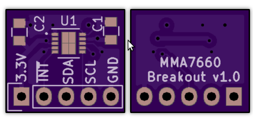

MMA7660 3-axis Accelerometer Breakout v1.0
===========================================

This is a breadboard-compatible breakout board for the MMA7660 accelerometer.

The project is released as open hardware under the CERN v1.2 Open Hardware license.

The project uses the Teensy template and footprint from <a href="http://wickerbox.net/wickerlib">wickerlib</a>.

You can order a set of three bare boards for $1.20 from OSH Park <a href="https://oshpark.com/shared_projects/1vI6D3RK">here</a>.

