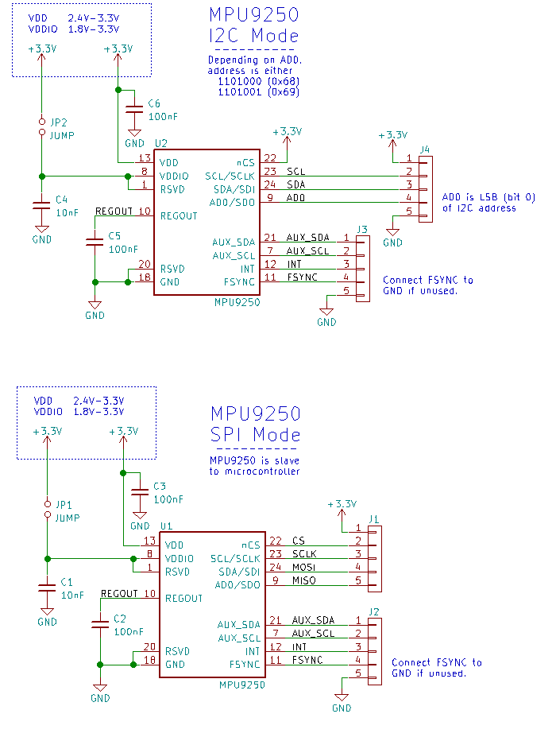
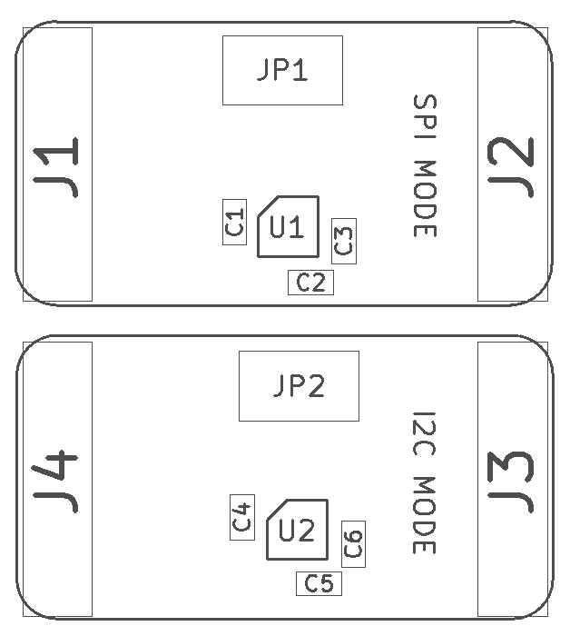
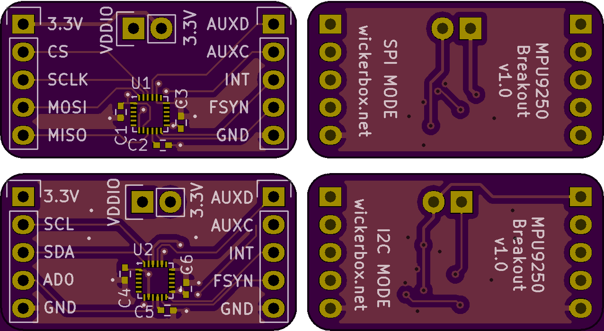

<!--- start title --->
# MPU9250 9-axis IMU Breakout Board v1.0
A breadboard-compatible breakout board for the MPU9250 9-axis IMU sensor.

Updated: 01 Jan 2017

Author: Jenner Hanni
Website: http://wickerbox.net
Company: Wickerbox Electronics
License: CERN Open Hardware License v1.2

<!--- end title --->

There are two boards in the same file, one in SPI mode and one in I2C mode. 

### Bill of Materials

<!--- bom start --->
|Ref|Qty|Description|Digikey PN|
|---|---|-----------|------|
|C1 C4|2|CAP CER 10000PF 50V X7R 0402|311-1349-1-ND|
|C3 C2 C6 C5|4|CAP CER 0.1UF 16V X7R 0402|1276-1001-1-ND|
|J1 J2 J4 J3|4|HEADER MALE 5POS TH 1x05 0.1”|952-1902-ND|
|JP1 JP2|2|SHUNT JUMPER 0.1IN BLACK GOLD|3M9580-ND|
|U1 U2|2|GYRO/ACCEL/MAG 9-AXIS I2C/SPI QFN24 MPU9150|1428-1019-1-ND|
<!--- bom end --->
\pagebreak

### Assembly Diagrams

### Board Preview

