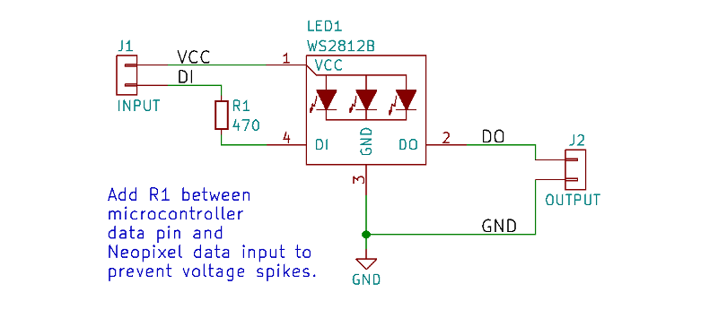
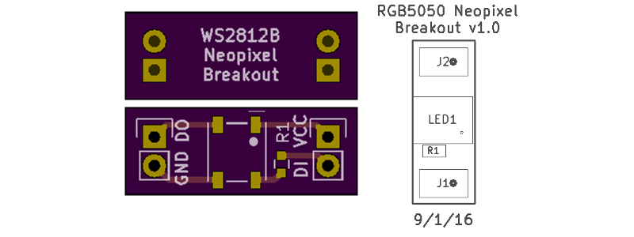

<!--- start title --->
# Neopixel WS2812B Breakout Board vv1.0
This is a breadboard-compatible breakout board for a WS2812B or 5050-compatible RGB "Neopixel" LED.

Updated: 1 Sep 2016

- Author: Jenner Hanni
- Website: http://wickerbox.net
- Company: Wickerbox Electronics
- License: CERN Open Hardware License v1.2

<!--- end title --->

It must be used with 5V, and includes a 470-ohm resistor on the input DI line to protect against voltage spikes. The project is released as open hardware under the CERN v1.2 Open Hardware license.

You can order a set of three bare boards for $1.20 <a href="https://oshpark.com/shared_projects/Zs3Bet2O">from OSH Park</a>.

<!--- bom start --->
|Ref|Qty|Description|Digikey PN|
|---|---|-----------|------|
|J2 J1|2|HEADER MALE 2POS TH 1x02 0.1”|952-2262-ND|
|LED1|1|LED RGB WS2812B W/DVR 4SMD|1528-1104-ND|
|R1|1|RES SMD 470 OHM 5% 1/4W 0603|RHM470DCT-ND|
<!--- bom end --->

