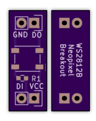
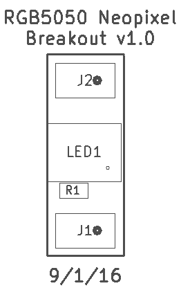

Neopixel WS2812B Breakout v1.0
===========================================

This is a breadboard-compatible breakout board for a WS2812B or 5050-compatible RGB "Neopixel" LED.

It must be used with 5V, and includes a 470-ohm resistor on the input DI line to protect against voltage spikes. 

The project is released as open hardware under the CERN v1.2 Open Hardware license.

You can order a set of three bare boards for $1.20 from OSH Park <a href="https://oshpark.com/shared_projects/Zs3Bet2O">here</a>.

|Ref|Qty|Description|Mfr Name|Mfr PN|Digikey PN|
|---|---|-----------|--------|------|----------|
|J1,J2|2|HEADER MALE 2POS TH 1x02 0.1”|Harwin|M20-9990246|952-2262-ND|
|LED1|1|LED RGB WS2812B W/DVR 4SMD|Adafruit|1655|1528-1104-ND|
|R1|1|RES SMD 470 OHM 5% 1/4W 0603|Rohm Semi|ESR03EZPJ471|RHM470DCT-ND|

