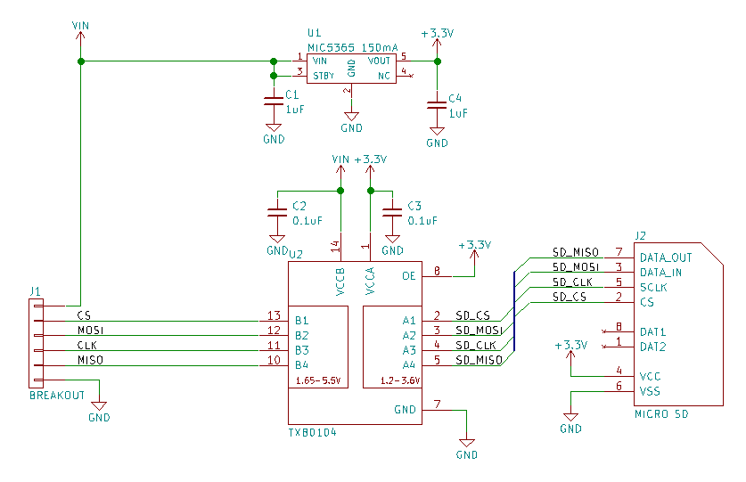
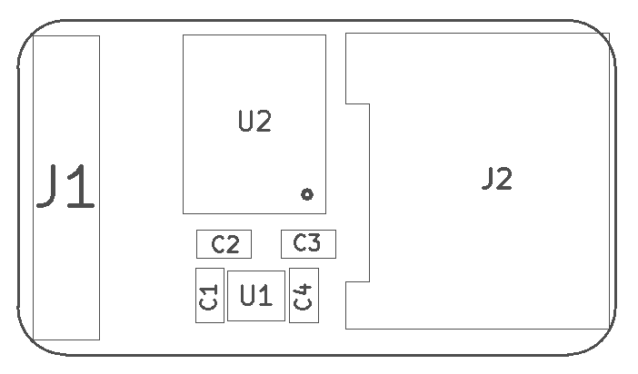
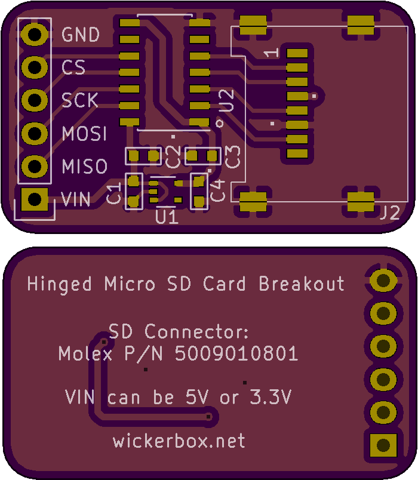

<!--- start title --->
# Micro SD Connector (5009010801) Breakout Board vv1.0
Breadboard- and 3V/5V-compatible micro SD breakout board.

Updated: 24 Feb 2017

- Author: Jenner Hanni
- Website: http://wickerbox.net
- Company: Wickerbox Electronics
- License: CERN Open Hardware License v1.2

<!--- end title --->

<!--- bom start --->
### Bill of Materials

|Ref|Qty|Description|Digikey PN|
|---|---|-----------|------|
|C2 C3|2|CAP CER 0.1UF 100V X7R 0603|490-3285-1-ND|
|C4 C1|2|CAP CER 1UF 25V X7R 0603|587-2984-1-ND|
|J1|1|HEADER MALE 6POS TH 1x06 0.1”|952-1902-ND|
|J2|1|CONN MICRO SD CARD HINGED TYPE|WM19081CT-ND|
|U1|1|IC REG LDO 3.3V 0.15A SOT353|576-3193-1-ND|
|U2|1|IC VOLT-LEVEL TRANSLATOR TXB0104 SOIC14|296-21928-1-ND|

<!--- bom end --->

