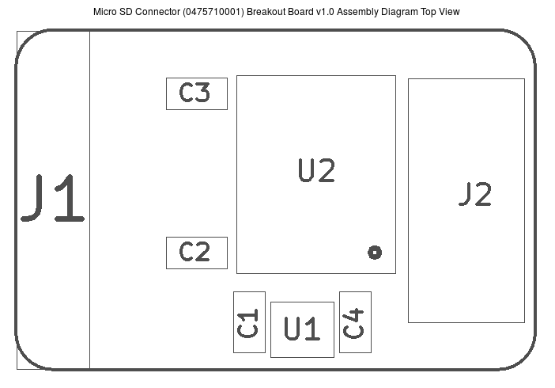
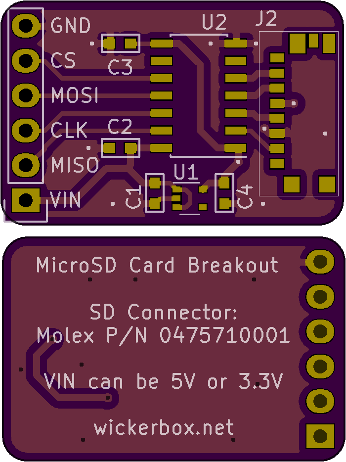

<!--- start title --->
# Micro SD Connector (0475710001) Breakout Board vv1.0
Breadboard- and 3V/5V-compatible micro SD breakout board.

Updated: 01 Jan 2017

Author: Jenner Hanni
Website: http://wickerbox.net
Company: Wickerbox Electronics
License: CERN Open Hardware License v1.2

<!--- end title --->
Intro text.

### Bill of Materials

<!--- bom start --->
<!--- bom end --->

