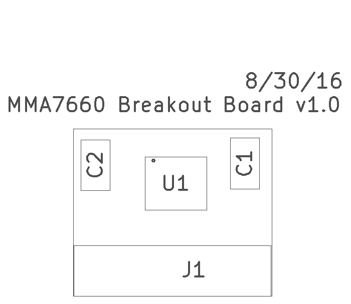

MMA7660 3-axis Accelerometer Breakout v1.0
===========================================

This is a breadboard-compatible breakout board for the MMA7660 accelerometer.

The project is released as open hardware under the CERN v1.2 Open Hardware license.

You can order a set of three bare boards for $1.20 from OSH Park <a href="https://oshpark.com/shared_projects/1vI6D3RK">here</a>.

|Ref|Qty|Description|Mfr Name|Mfr PN|Digikey PN|
|---|---|-----------|--------|------|----------|
|U1|1|IC ACCELEROMETER 3X3 DGTL 10-DFN|Freescale NXP|MMA7660FCT|MMA7660FCT-ND|
|J1|1|HEADER MALE 5POS TH 1x05 0.1”|Harwin|M20-9992046|952-1902-ND|
|C1,C2|2|CAP CER 0.1UF 25V X7R 0805|Samsung|CL21B104KACNNNC|1276-1099-1-ND|

