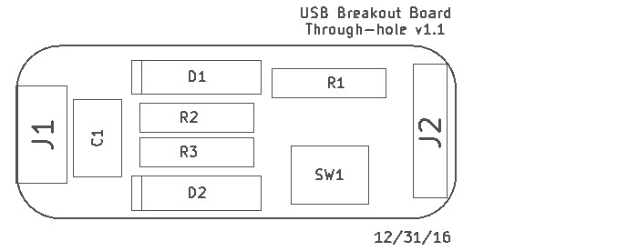
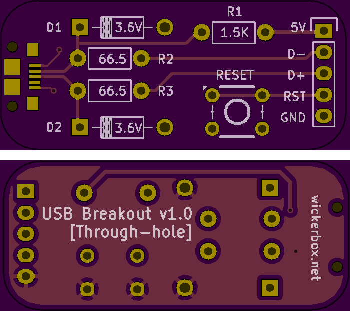

<!--- start title --->
# USB Breakout Board vv1.1
Breadboard-compatible breakout of a micro USB connector.

Updated: 31 Dec 2016

Author: Jenner Hanni
Website: http://wickerbox.net
Company: Wickerbox Electronics
License: CERN Open Hardware License v1.2

<!--- end title --->

### Bill of Materials

<!--- bom start --->
|Ref|Qty|Description|Digikey PN|
|---|---|-----------|------|
|C1|1|CAP CER 1UF 16V X7R RADIAL|445-8614-ND|
|D1 D2|2|DIODE ZENER 3.6V 1W BZX85C3V6 DO41|BZX85C3V6-ND|
|J1|1|USB MICRO-B RECEPTACLE 5PIN SMT R/A STUDS|609-4616-1-ND|
|J2|1|HEADER MALE 5POS TH 1x05 0.1”|952-1902-ND|
|R1|1|RES 1.5K OHM 1/2W 5% CF MINI|S1.5KHCT-ND|
|R3 R2|2|RES 66.5 OHM 1/4W 1% AXIAL|66.5XBK-ND|
|SW1|1| SWITCH TACTILE SPST-NO 0.05A 24V |SW400-ND|
<!--- bom end --->

